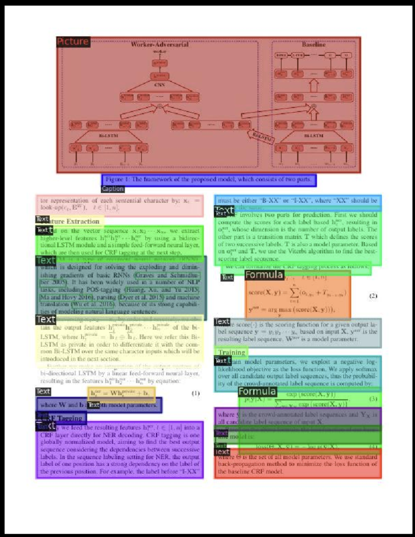

# 📄 Clean data is all you need




## Demo
[Link](https://cleandataisallyouneed.streamlit.app/)

## Installation

### Install requirements
```bash
pip install -r requirements.txt
```

To run the `dla_pipeline` install Docker.
